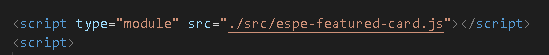
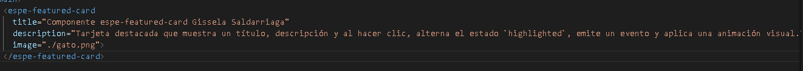
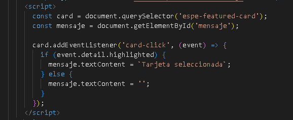
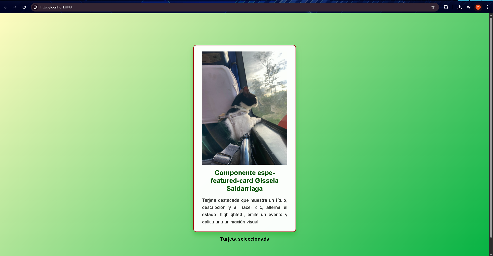
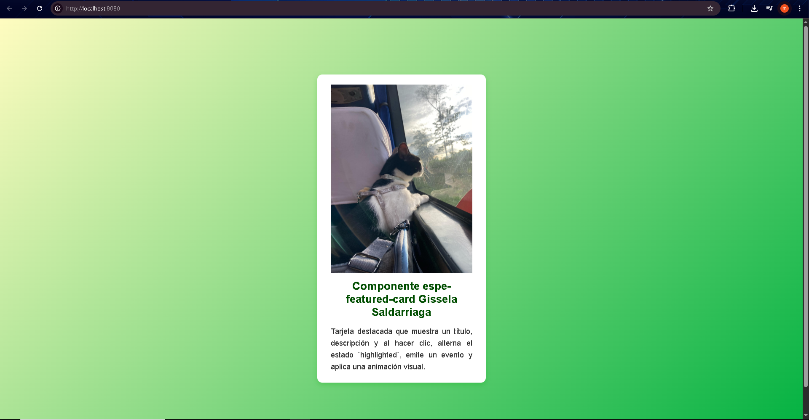

# Web Component espe-featured-card con LitElement - Gissela Saldarriaga

## Descripción del Proyecto
Este proyecto implementa un Web Component personalizado llamado `<espe-featured-card>`, desarrollado con LitElement. La tarjeta destacada muestra un título, una descripción y una imagen opcional. Al hacer clic, alterna un estado dinámico `highlighted`, emite un evento personalizado `card-click` y aplica una animación visual para indicar la selección.

---

## Estados Dinámicos en LitElement

### ¿Qué son los estados dinámicos?
Los estados dinámicos en LitElement son propiedades reactivas que al cambiar actualizan automáticamente la interfaz del componente, permitiendo que el DOM se actualice de forma eficiente y declarativa.

### Implementación en `<espe-featured-card>`

- Se declara la propiedad reactiva `highlighted` en `static properties` con reflexión para poder usar estilos basados en atributos.
- Cuando se hace clic en la tarjeta, se invierte el valor de `highlighted`.
- LitElement detecta el cambio y vuelve a renderizar el componente con la nueva apariencia (por ejemplo, borde rojo y animación).
- El cambio de estado también dispara un evento personalizado para notificar a componentes externos.

```js
static properties = {
    title: { type: String },
    description: { type: String },
    image: { type: String },
    highlighted: { type: Boolean, reflect: true }
};

_handleClick() {
  this.highlighted = !this.highlighted;
  this.dispatchEvent(new CustomEvent('card-click', {
    detail: { highlighted: this.highlighted, title: this.title },
    bubbles: true,
    composed: true
  }));
}
```

---

## Uso de Eventos Personalizados para Integración

Los eventos personalizados permiten que el componente comunique cambios o acciones hacia su entorno sin romper el encapsulamiento ni crear dependencias fuertes.

### En `<espe-featured-card>`

- Se emite el evento `card-click` con información relevante en su `detail` (estado `highlighted` y `title`).
- Este evento burbujea y atraviesa el Shadow DOM para ser escuchado externamente.

### Ejemplo de escucha en el documento padre:

```js
const card = document.querySelector('espe-featured-card');
const mensaje = document.getElementById('mensaje');

card.addEventListener('card-click', (event) => {
  if(event.detail.highlighted) {
    mensaje.textContent = 'Tarjeta seleccionada';
  } else {
    mensaje.textContent = '';
  }
});
```

### Ventajas de eventos personalizados

- Permiten integración sencilla y desacoplada con otros componentes o scripts.
- Facilitan la comunicación y coordinación en aplicaciones web complejas.
- Mejoran la reutilización y mantenimiento del componente.

---

## Ventajas de LitElement sobre JavaScript Puro en Web Components

| Característica                 | JavaScript Puro                                         | LitElement                                          |
|-------------------------------|--------------------------------------------------------|----------------------------------------------------|
| Declaración de propiedades     | Manual con getters/setters y manejo de cambios manual  | `static properties` con reactividad automática     |
| Renderizado eficiente          | Manipulación manual del DOM o innerHTML                 | Plantillas declarativas con `render()` y `html`    |
| Estilos encapsulados           | Shadow DOM, pero estilos deben aplicarse manualmente    | Soporte CSS encapsulado con `static styles`        |
| Actualización condicional      | Requiere lógica para actualizar solo lo necesario       | Actualización automática solo de partes afectadas  |
| Emisión de eventos             | Creación manual de eventos CustomEvent                   | Fácil integración con eventos y composición        |
| Tamaño y complejidad           | Código más extenso y propenso a errores                  | Código más compacto, legible y mantenible           |

---

## Pruebas realizadas

### 1. Componente en funcionamiento

- Registro del custom element `espe-featured-card` en JavaScript.
- Uso en HTML con atributos para título, descripción e imagen.
- Interacción al hacer clic que alterna el estado `highlighted` y muestra mensaje dinámico.

### 2. Cambios visuales con estados dinámicos

- Animación `fadeIn` aplicada cuando la tarjeta está resaltada.
- Borde rojo visible solo cuando `highlighted` está activo.

### 3. Comunicación vía evento personalizado

- Evento `card-click` escuchado desde el documento padre.
- Mensaje actualizado en pantalla indicando el estado de selección.

---

## Cómo usar el componente

1. Incluir el script del componente:
 

2. Insertar la tarjeta en HTML:
 

3. Escuchar el evento personalizado para reaccionar a la selección:
 


---

## Capturas de pantalla

  


---

## Autor

**Gissela Saldarriaga**
